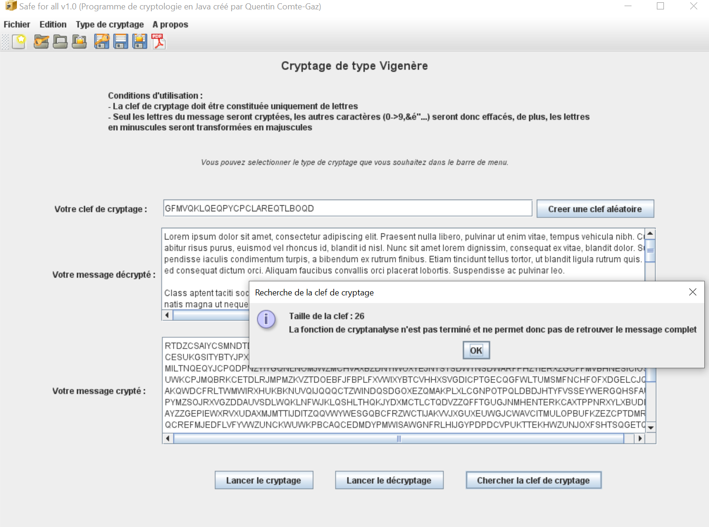

# Safe For All (explain how cryptology works)

  

## What is it

This application (in French) can encrypt/decrypt/generate keys of Cesar, optimized Cesar, Vigenère, optimized Vigenère and DES algorithm.
It can also try to attack those algorithm (working with Cesar and partially with Vigenère).

It is possible to export in pdf format encrypting/decrypting done in the application (for training purpose).
You can also export/import encrypted/decrypted files and keys for future use or for other usage.

More detail available on this <a href="https://github.com/QuentinCG/Safe-For-All/blob/master/Safe-For-All.pdf">pdf documentation</a>

## How to install

1) Be sure Java is installed in your computer (else download it <a href="https://www.java.com/fr/download/">here</a>)

2) Download the application <a href="https://github.com/QuentinCG/Safe-For-All/releases/download/1-0-0/Safe-For-All-1-0-0.jar">here</a>

3) Launch the application

## Warnings

This Java application was designed when I was at school and didn't have a lot of knowledge in coding.
It is therefore working but not optimized.

## License

This project is under MIT license. This means you can use it as you want.

## Contribute

If you want to improve the application, just create a pull request with proper commit message and right wrapping.
